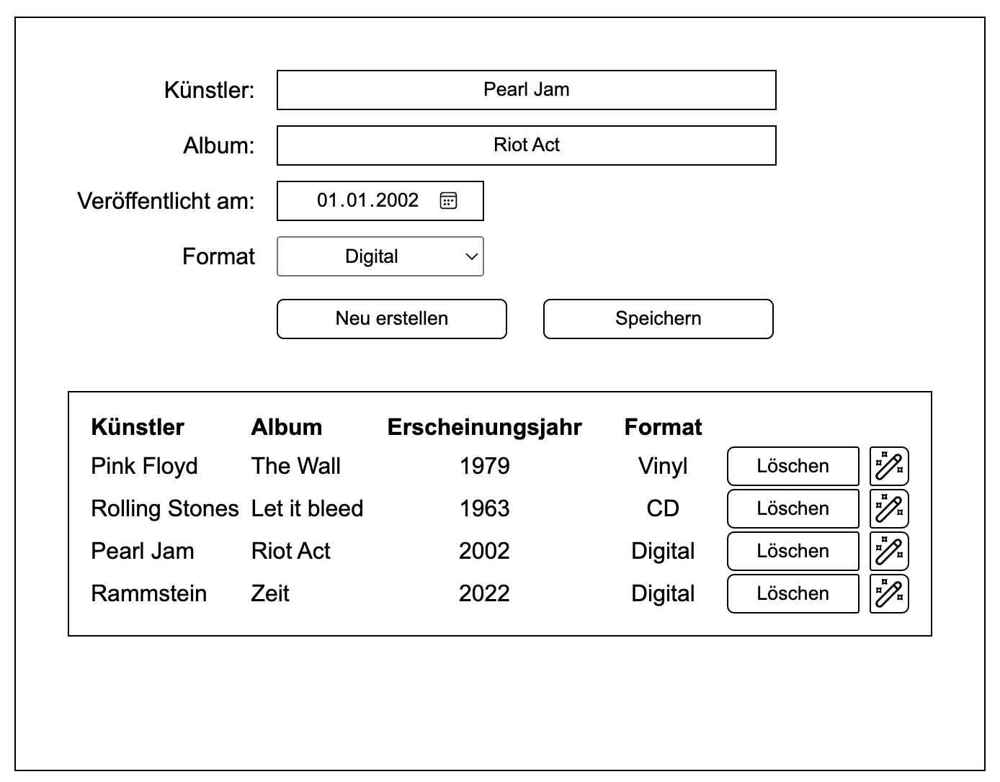

# CRUD-mit-PHP



<br>

## Datenbank erstellen (auf PHPMyAdmin):

Wichtig, mann muss `AUTO_INCREMENT` mit dazu verwenden, damit die ID automatisch hochzählt - sonst wirft es einen Error.

```sql
CREATE TABLE music_collection (
    id INT AUTO_INCREMENT PRIMARY KEY,
    artist VARCHAR(100),
    album VARCHAR(100),
    published DATE,
    format CHAR(1)
);
```

---

## Verbindung zur Datenbank in PHP:

Nicht vergessen, `Nachnamen` mit **deinen** Nachname zu ändern und genauso das Passwort:

```php
$servername = "localhost";
$username = "y23_2A_{NACHNAME}";
$password = "";
$database = "y23_2A_{NACHNAME}";
```

---

## PHP-Dateien:

### Verbindung zu Datenbank testen: [test_to_db.php](./test_to_db.php)

### Normale Funktionen implementiert: [music.php](./music.php)

### Komplettes CRUD (+ erweiterung mit `Update`): [music2.php](./music2.php)
