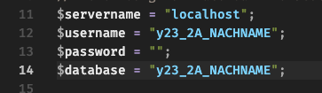

# CRUD-mit-PHP

## WMC-Aufgabe:

### Create, Read, Update, Delete -> Datenbanken mit PHP

 

## NICHT 1:1 KOPIEREN!

 

---

### Verbindung zur Datenbank:

Nicht vergessen, `Nachnamen` mit **deinen** Nachname zu ändern und genauso das Passwort:

